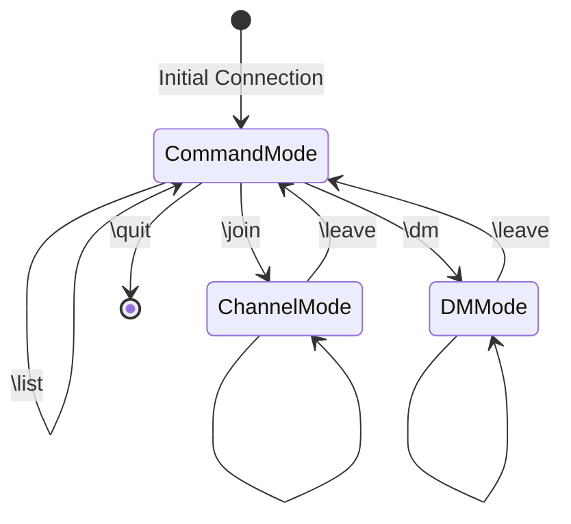

# State Transition Diagram for reChat

## State Descriptions

### CommandMode
- Initial state when user connects
- Allows basic commands: \list, \quit, \join, \dm
- No active channel or user

### ChannelMode
- Entered via \join <channel>
- Allows channel-specific commands: \leave, \read
- Allows posting messages to channel
- Tracks current channel

### DMMode
- Entered via \dm <username>
- Allows DM-specific commands: \leave, \read
- Allows sending direct messages
- Tracks current user

## Transition Rules

1. CommandMode Transitions:
   - \join <channel> → ChannelMode (if valid channel)
   - \dm <username> → DMMode (if valid username)
   - \list <spec> → CommandMode (stays in command mode)
   - \quit → [*] (disconnect)

2. ChannelMode Transitions:
   - \leave → CommandMode
   - \read → ChannelMode (stays in channel mode)
   - <message> → ChannelMode (stays in channel mode)

3. DMMode Transitions:
   - \leave → CommandMode
   - \read → DMMode (stays in DM mode)
   - <message> → DMMode (stays in DM mode)

## Notes
- All transitions maintain state information (current channel/user)
- Invalid commands result in error but maintain current state
- Regular messages (not starting with \) only allowed in ChannelMode or DMMode 